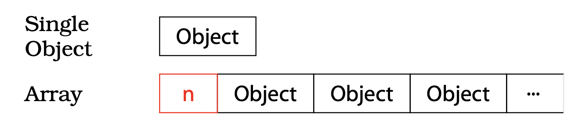

# Chapter 03

## Item 13: Use objects to manage resources

### How to Use Objects to Manage Resources
1. 자원을 획득한 후에 자원 관리 객체에게 넘긴다.
2. 자원 관리 객체는 자신의 소말자를 사용해서 자원이 확실히 해제되도록 한다.

#### RAII(Resource Acquisition Is Initialization)
~~`std::auto_ptr`~~(C++ 17에서 deprecated), `std::unique_ptr`이 있다.

auto_ptr은 자신이 소멸될 때 자신이 가리키던 자원을 자동으로 해제하기 때문에 어떤 객체가 auto_ptr을 복사하면, 복사된 객체는 원본 객체가 가리키던 자원을 가리키고 원본 객체는 자신이 가리키던 자원을 포기하게 된다.

`std::auto_ptr` 소멸동작 방식에서 배열 내부의 각 객체에 대한 delete만 수행되어서 배열 이름의 주소값만을 해제하는 문제가 있어서 C++ 17에서 deprecated되었다.

대신 `std::unique_ptr`을 사용하면 된다 `std::unique_ptr`은 `std::auto_ptr`과 달리 대입으로 자원을 이전할 수 없고 move로만 이전할 수 있다.

#### RCSP(Resource Counting Smart Pointer)
`std::shared_ptr`이 있다.

`std::shared_ptr`은 자신이 가리키는 객체에 대한 참조 횟수를 관리한다. 참조 횟수가 0이 되면 자동으로 자원을 해제한다.
참조 상태가 고리를 이루는 경우를 없앨 수 없다는 점을 제외하고는 `garbage collection`과 흡사하다

`std::auto_ptr`과 동일하게 배열을 가리키는 경우에는 사용할 수 없다.

### Things to Remember
- 자원 누출을 막기 위해, 생성자 안에서 자원을 획득하고 소멸자에서 그 것을 해제하는 RAII 객체를 사용하자.

## Item 14: Think carefully about copying behavior in resource-managing classes

### What behavior should happen when copying RAII objects?
- 복사를 금지한다.
- 관리하고 있는 자원에 대해 참조 카운팅을 수행한다.
- 관리하고 있는 자원을 `Deep Copy`한다.
- 관리하고 있는 자원의 소유권을 이전한다.

### Things to Remember
- RAII 객체의 복사는 그 객체가 관리하는 자원의 복사 문제를 안고 가기 때문에, 그 자원을 어떻게 복사하느냐에 따라 RAII 객체의 복사 동작이 결정된다.
- RAII 클래스에 구현하는 일반적인 복사 동작은 복사를 금지하거나 참조 카운팅을 해주는 선으로 마무리하는 것이다. 하지만 이 외의 방법도 있다.

## Item 15: Provide access to raw resources in resource-managing classes

### Things to Remember
- 실제 자원을 직접 접근해야 하는 기존 API들도 많기 때문에, RAII 클래스를 만들 때는 그 클래스가 관리하는 자원을 얻을 수 있는 방법을 열어 주어야 합니다.
- 자원 접근은 명시적 변환 혹은 암시적 변환을 통해 가능합니다. 안전성만 따지면 명시적 변환이 대체적으로 더 낫지만, 고객 편의성을 놓고 보면 암시적 변환이 괜찮습니다.

## Item 16: Use the same form in corresponding uses of new and delete
### new
1. 메모리 할당(이 때, operator new 호출)
2. 할당된 메모리에 대한 생성자 호출

### delete
1. 기존에 할당된 메모리에 대한 소멸자 호출
2. 메모리 해제(이 때, operator delete 호출)

`delete` 연산자가 적용되는 객체는 `소멸자가 호출된 횟수`다.

배열을 위해 할당된 힙 메모리에는 대개 배열 원소의 개수가 저장되어 있다. 어떤 포인터에 대해 `delete` 연산을 수행할 때 `[]`을 뒤에 붙여 `배열 크기 정보가 있다`는 것을 알려줄 수 있다.

### Things to Remember
- `new` 표현식에 `[]`를 썼으면, 대응되는 `delete` 표현식에도 `[]`를 써야 한다. 마찬가지로 `new` 표현식에 `[]`를 쓰지 않았으면, 대응되는 `delete` 표현식에도 `[]`를 쓰지 않아야 한다.

## Item 17: Store `new`ed objects in smart pointers in standalone statements

### Things to Remember
- `new`로 생성한 객체를 스마트 포인터로 넣는 코드는 별도의 한 문장으로 만들자. 이 것이 안되어 있으면, 예외가 발생할 때 디버깅하기 힘든 자원 누출의 가능성이 있다.
